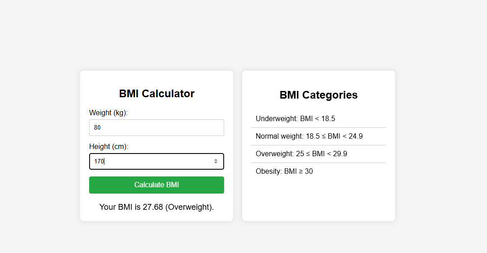

# BMI Calculator

A simple BMI (Body Mass Index) Calculator that calculates and displays the BMI based on user input (weight and height). The application also provides BMI categories to help users understand their BMI range.

## Table of Contents

- [Demo](#demo)
- [Features](#features)
- [Technologies Used](#technologies-used)
- [Setup](#setup)
- [Usage](#usage)
- [License](#license)

## Demo

You can see a live demo of the BMI Calculator [here](#).

## Features

- Calculate BMI based on user input (weight and height)
- Display BMI result along with the corresponding category
- Responsive design for different screen sizes
- Clear and simple user interface

## Technologies Used

- HTML
- CSS
- JavaScript

## Setup

1. Clone the repository:
    ```bash
    git clone https://github.com/yourusername/bmicalculator.git
    ```

2. Navigate to the project directory:
    ```bash
    cd bmicalculator
    ```

3. Open `index.html` in your web browser to use the BMI Calculator.

## Usage

1. Open the BMI Calculator in your web browser.
2. Enter your weight in kilograms (kg).
3. Enter your height in centimeters (cm).
4. Click the "Calculate BMI" button.
5. View your BMI result and the corresponding category.

## Screenshot


